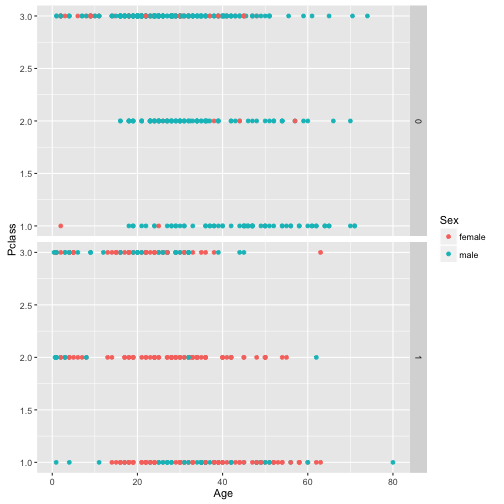

Developing Data Products Course Project
=======================================
author: Nicholas Chan
date: 31st January 2014
transition: rotate

Introduction
============
1. Slide is produced for Data Products Project, to learn how to produce and publish web app to shinyapss.io.
2. Dataset picked from Kaggle's Titanic Challenge
  * https://www.kaggle.com/c/titanic/data
  * Only Training Set is used.
3. Web Application
  * https://zynick.shinyapps.io/project
4. GitHub Repo
  * https://github.com/zynick/Data-Science-Data-Products-Project


Code for Plots
==============
ggplot 2 Library was used for plotting. Code sample of the default plot that is rendered on web app:


```r
library(ggplot2)
trainData <- read.csv(
url("https://raw.githubusercontent.com/zynick/Data-Science-Data-Products-Project/master/data/train.csv"))
g <- ggplot(trainData, aes(Age, Pclass))
g + geom_point(aes(color=Sex)) + facet_grid(Survived ~.)
```
***
 


Guidelines to Reproduce Locally
===============================
1. Install necessary packages to run RStudio's Shiny Server locally.
  * http://shiny.rstudio.com/articles/shinyapps.html
2. Run the following command in the RStudio:
  * runGitHub( "Data-Science-Data-Products-Project", "zynick")

Cloning Github repo is not necessary.


More Information
================
1. Data Science Course
  * https://www.coursera.org/learn/data-products
2. Getting Started with Shiny Apps
  * http://shiny.rstudio.com/articles/shinyapps.html
3. Kaggle - Titanic Challenge Details
  * https://www.kaggle.com/c/titanic

Thank You!

